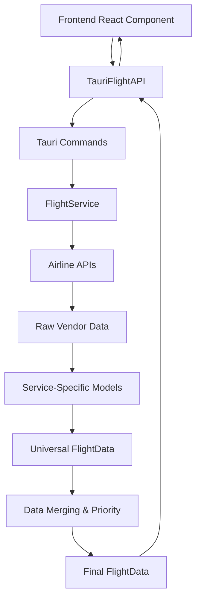

# Inflight Tracker - Rust Backend Architecture

## Overview

The Inflight Tracker has been upgraded with a Rust backend using Tauri, providing a more robust and efficient API layer for flight data management. This document outlines the new architecture and data flow.

## Architecture Components

### 1. Rust Backend (`src-tauri/`)

#### Data Models (`src-tauri/src/models/`)

**FlightData** - Universal flight data structure with comprehensive merge capabilities:
```rust
pub struct FlightData {
    pub timestamp: String,
    pub eta: Option<String>,
    pub flight_duration: i32,
    pub flight_number: String,
    pub latitude: f64,
    pub longitude: f64,
    // ... additional fields
}
```

**Service-Specific Models**:
- `AAIntelsatFlightData` - American Airlines Intelsat API structure
- `AAViaSatFlightData` - American Airlines ViaSat API structure  
- `JetBlueFlightData` - JetBlue API structure

**Data Source Priority System**:
```rust
pub enum DataSource {
    AmericanIntelsat,  // Priority: 10 (highest)
    AmericanViasat,    // Priority: 9
    JetBlue,           // Priority: 8
}
```

#### Services (`src-tauri/src/services/`)

**FlightService** - Core API client:
- Fetches data from airline APIs
- Converts service-specific data to universal FlightData
- Implements intelligent data merging with priority handling
- Provides vendor availability testing

**VendorDetector** - Smart vendor management:
- Automatically detects available flight data vendors
- Validates cached vendor availability
- Returns vendors sorted by priority

#### Commands (`src-tauri/src/commands/`)

**Tauri Commands** exposed to frontend:
- `get_flight_data(vendor)` - Fetch data from specific vendor
- `detect_vendors()` - Get all available vendors
- `get_primary_vendor()` - Get highest priority available vendor
- `validate_vendor(vendor)` - Check if vendor is still working
- `merge_flight_data(data_list)` - Merge multiple data sources
- `get_all_available_data()` - Fetch and merge from all sources

### 2. Frontend Integration (`lib/tauri-api.ts`)

**TauriFlightAPI** - TypeScript wrapper for Rust commands:
- Handles data conversion between Rust snake_case and TypeScript camelCase
- Provides type-safe interfaces
- Maintains compatibility with existing React components

**TauriFlightService** - Legacy compatibility layer:
- Drop-in replacement for previous direct API calls
- Maintains existing component interfaces
- Enables gradual migration

### 3. Data Flow



## Key Features

### 1. **Priority-Based Data Merging**

When multiple vendors provide conflicting data, the system uses priority levels to determine which data to use:

```rust
impl FlightData {
    pub fn merge_with_priority(&mut self, other: &FlightData, other_source: DataSource, self_source: DataSource) {
        let other_has_priority = other_source.priority() > self_source.priority();
        // Intelligent field-by-field merging logic
    }
}
```

### 2. **Automatic Vendor Detection**

The system automatically detects which airline APIs are available and selects the best one:

```rust
pub async fn detect_available_vendors(&self) -> Vec<String> {
    // Tests each vendor endpoint
    // Returns sorted by priority (highest first)
}
```

### 3. **Robust Error Handling**

```rust
#[derive(Debug, thiserror::Error)]
pub enum FlightServiceError {
    #[error("HTTP request failed: {0}")]
    RequestError(#[from] reqwest::Error),
    #[error("JSON parsing failed: {0}")]
    JsonError(#[from] serde_json::Error),
    #[error("Unsupported vendor: {0}")]
    UnsupportedVendor(String),
}
```

### 4. **Type-Safe Data Conversion**

Each service-specific model implements the `ToFlightData` trait:

```rust
pub trait ToFlightData {
    fn to_flight_data(&self) -> FlightData;
    fn data_source() -> DataSource;
}
```

## Usage Examples

### Fetch Data from Primary Vendor
```typescript
const flightData = await TauriFlightAPI.getAllAvailableData();
```

### Get Available Vendors
```typescript
const vendors = await TauriFlightAPI.detectVendors();
// Returns: ["american-intelsat", "american-viasat", "jetblue"]
```

### Manual Data Merging
```typescript
const mergedData = await TauriFlightAPI.mergeFlightData([
  [data1, "american-intelsat"],
  [data2, "jetblue"]
]);
```

## Benefits

1. **Performance**: Rust backend provides faster data processing
2. **Reliability**: Built-in error handling and retry logic
3. **Maintainability**: Clean separation of concerns
4. **Extensibility**: Easy to add new airline data sources
5. **Type Safety**: Compile-time guarantees for data structures
6. **Smart Merging**: Intelligent conflict resolution between data sources

## Development

### Adding New Data Sources

1. Create model in `src-tauri/src/models/`
2. Implement `ToFlightData` trait
3. Add vendor to `FlightService`
4. Update `DataSource` enum with priority
5. Add vendor detection logic

### Testing

```bash
# Test Rust backend
cargo test --manifest-path src-tauri/Cargo.toml

# Test frontend integration
pnpm tauri:dev
```

## Migration Notes

The frontend has been updated to use the Rust backend while maintaining full backward compatibility. The `FlightDataContext` now uses `TauriFlightService` instead of direct `fetch()` calls, but all React components continue to work unchanged.
